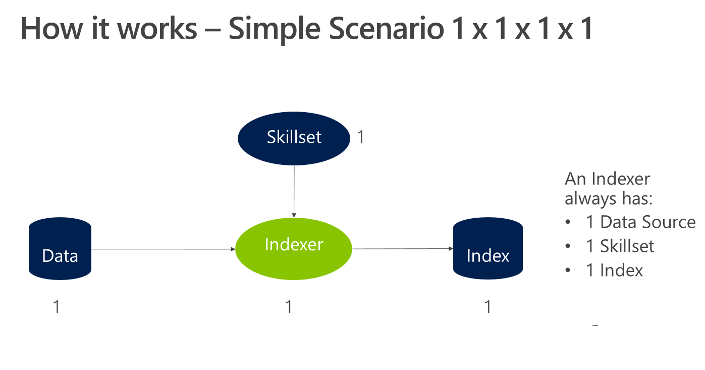
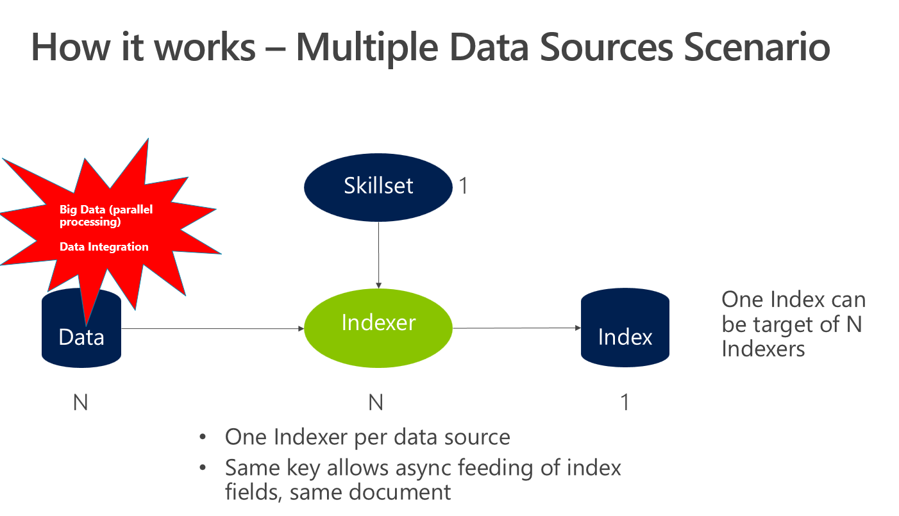
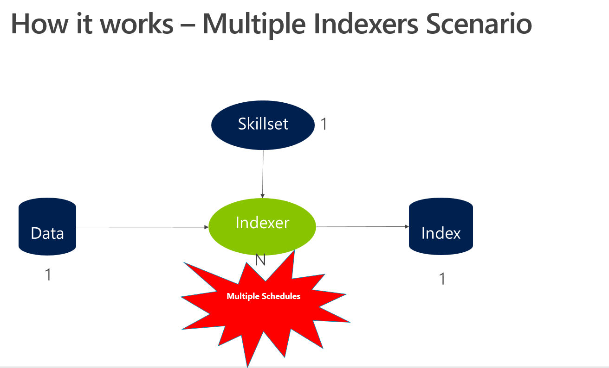

# Final Case

## Objective

> Note: This activity was designed as a group exercise for in-classroom ILTs (Instructor Lead Trainings), the idea is a final discussion after the exercise. But you also can do it if by yourself.

## Complex Scenarios

Now you are very familiar to 1x1x1x1 scenarios: one dataset, one index, one skillset and one indexer. The diagrams below describe this situation but also complex scenarios of Cognitive Search.

### Performance Optimization with Partitioning for Parallel Processing

Parallel processing helps to increase performance of your indexing process, with 2 or more indexers running at the same time. They will be using partitioned data sources and sharing the same target index.

To divide the data into multiple containers, or partitions, helps to increase performance. It is required to create one data source and one indexer for partition, pointing to the same index. It is possible to use the same skillset or not, depends on the business requirements and also how the partitions were made. As an example, let's say that all images are separated from text documents. In this case, it may make sense to have different skillsets for the images and text documents.

To run them in parallel, Standard Service Tier is required, with the correct number of replicas and partitions. The number or maximum parallel indexers executions at the same time is calculated with this simple formula: number of partitions x number of replicas. If you have 3 replicas and 3 partitions, you can have up to 9 indexers at the same time.

For more information on sizing, click [here](https://docs.microsoft.com/en-us/azure/search/search-capacity-planning).

### Cognitive Search Typical Scenarios

The diagrams below explain some of the scenarios for Cognitive Search

1. **Simple Scenario**: Visual representation of the scenario addressed in this training.
1. **Multiple Data Sources Scenario**: It is the situation explained in the section above, about parallel processing: Big data volume requires parallel processing, what demands data partitioning and one indexer per partition.
   + If the data was partitioned per timestamp, you should the same indexer definition for all indexers.
   + If the data was partitioned by business rules or file types, you can see different indexers definitions. Image skills are heavier than text ones. If your images are separated in a partition, you can increase performance not applying image skills on text documents.
1. **Multiple Indexes Scenario**: The third scenario is used when you need to physically isolate the created metadata.
1. **Multiple Indexers Scenario**: Typically used when you need to use multiple schedules and skillsets to index the data. Example: The data source has files updated every 15 minutes and other files updated every hour and other files updated when a new file arrives in a folder.
1. **Multiple Skisets Scenario**: This scenario is used when you have one of the following situations:
   + A Custom Skill that has different update times. So, you don't need to call that API for all of your executions.
   + Your data has multiple updates periods. Example: images are updated in the morning, text documents in the afternoon.

## Case Study

Contoso Vineyard is a relatively new vineyard that is gaining popularity quickly due to several factors. One reason is that Contoso Vineyard operates on a monthly subscription model, with progressive discounts.
The company has an  award-winning customer service, what helped the business growth in South America countries. While Gold subscribers can chat with sommeliers to customize the next wine delivery, Silver clients can chat with intelligent bots to customize their options.

Now the company needs to increase their search capabilities, for channels like chat, web portal and mobile Application. Contoso Vineyard needs to enrich and index their product catalog to increase accuracy of clients and sommeliers searches. The product catalog is a series of HTML, Microsoft Word and PDFs documents. Some of them have images and they are all written in English, which is a problem for their Latin America clients.

They also want to provide links for places, grapes and other entities their data has. The company owner and the Master Sommelier are famous figures and the marketing department wants to highlight this as well.

## Exercise

Using what you've learned throughout the course, develop a potential Cognitive Search enrichment pipeline to help the company achieve their search business goals. The expected outputs of this exercise are:

1. Build your solution using one of the complex scenarios listed above. Justify your choice. Presenting another diagram is valid, you can draw freehand or use any software
1. List of the predefined and custom skills
1. The skills sequence and how they are integrated
1. The necessary Azure Search tier for this solution

## Cleaning your environment - Again

You have completed all of the hands-on portions of the course. We recommend deleting the resource group (and all of the resources in it) to avoid incurring extra charges.

## Next Step

[Back to Read Me](../README.md)